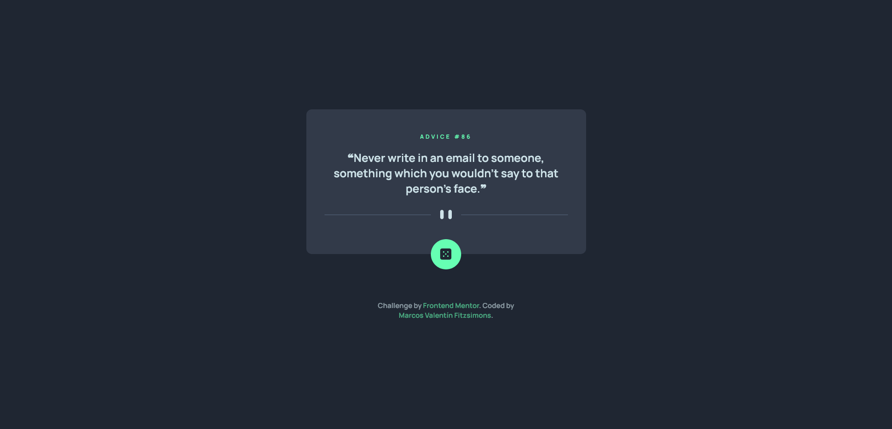

# Frontend Mentor - Advice generator app solution

This is a solution to the [Advice generator app challenge on Frontend Mentor](https://www.frontendmentor.io/challenges/advice-generator-app-QdUG-13db). Frontend Mentor challenges help you improve your coding skills by building realistic projects.

## Table of contents

- [Overview](#overview)
  - [The challenge](#the-challenge)
  - [Screenshot](#screenshot)
  - [Links](#links)
- [My process](#my-process)
  - [Built with](#built-with)
  - [What I learned](#what-i-learned)
- [Author](#author)

## Overview

### The challenge

Users should be able to:

- View the optimal layout for the app depending on their device's screen size
- See hover states for all interactive elements on the page
- Generate a new piece of advice by clicking the dice icon

### Screenshot



### Links

- Solution URL: [Here](https://github.com/Marcosfitzsimons/advice-generator-app)
- Live Site URL: [Here](https://advice-generator-app-eight.vercel.app/)

## My process

### Built with

- Semantic HTML5 markup
- CSS custom properties
- Flexbox
- CSS Grid
- Mobile-first workflow
- Vanilla Css/Javascript

### What I learned

How to fetch data from an API

```js
const fetchAdvice = async () => {
  try {
    const res = await fetch("https://api.adviceslip.com/advice", {
      cache: "no-cache",
    });
    if (!res.ok) {
      throw new Error("Api connection problem");
    }
    const data = await res.json();
    return data.slip;
  } catch (err) {
    console.log(err);
  }
};

const setAdvice = async () => {
  let advice = await fetchAdvice();
  let id = document.querySelector(".advice-id");
  let adviceText = document.querySelector(".advice-text");

  id.textContent = `ADVICE #${advice.id}`;
  adviceText.textContent = `❝${advice.advice}❞`;
};

btn.addEventListener("click", setAdvice);
setAdvice();
```

## Author

- Website - [Marcos Valentín Fitzsimons](https://marcosfitzsimons-portfolio.vercel.app/)
- Frontend Mentor - [@Marcosfitzsimons](https://www.frontendmentor.io/profile/Marcosfitzsimons)
